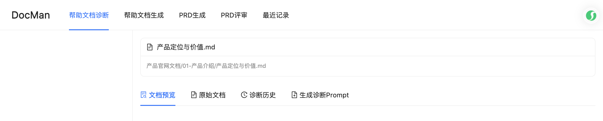
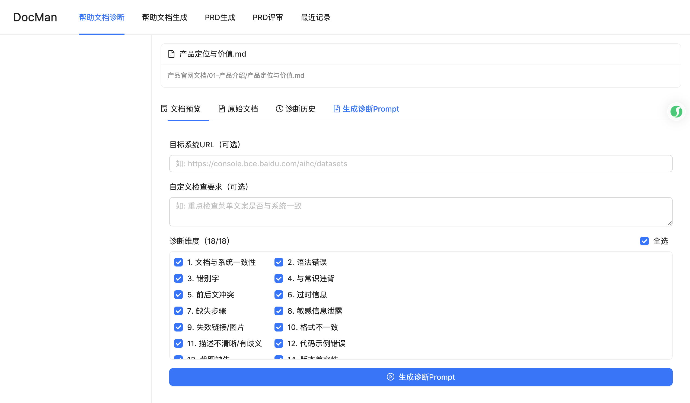
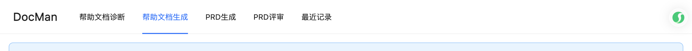
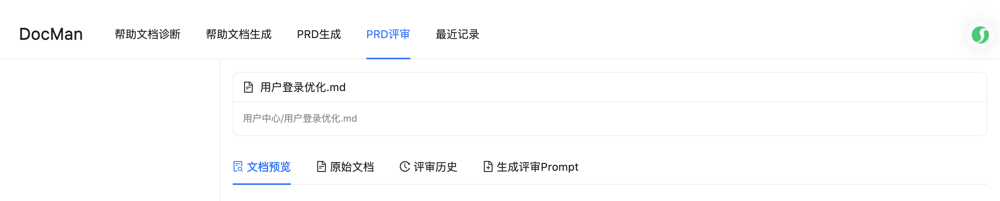
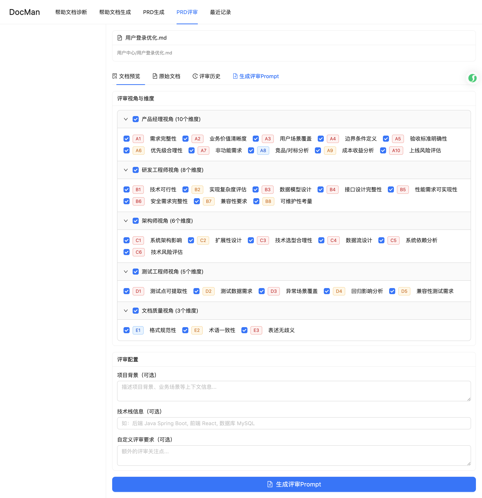
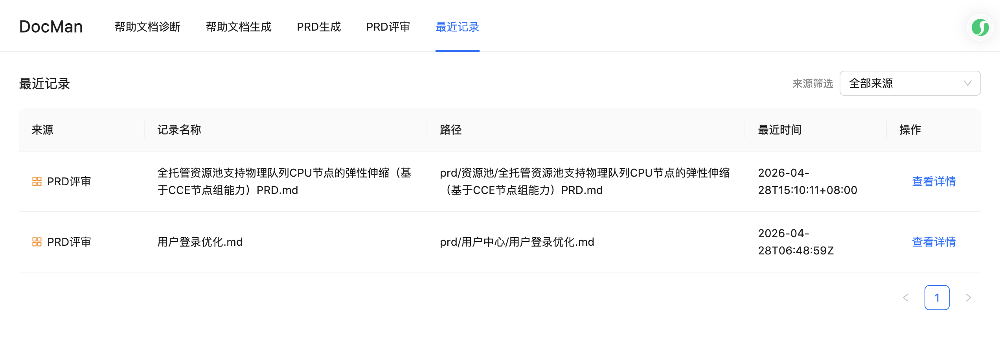

# DocMan 操作说明

## 概述

DocMan 是面向产品文档全生命周期的智能助手，覆盖**帮助文档诊断**、**帮助文档生成**、**PRD生成**与**PRD多视角评审**四大核心功能，并提供统一的最近记录聚合与详情跳转能力。

DocMan 采用「**Web 参数配置 + Prompt 生成 + 本地 Agent 执行 Skill**」的工作模式：

1. 在 DocMan Web 界面中选择任务类型并配置参数
2. DocMan 后端根据配置生成标准化 Prompt
3. 在本地 Agent（如 Comate 等）中执行 Prompt，触发对应 Skill 完成任务
4. 执行结果输出到项目目录，并通过「最近记录」统一查看和跳转

### 功能列表

| 功能模块 | 说明 |
|---------|------|
| 帮助文档诊断 | 对产品帮助文档进行 18 维度全方位质量检查 |
| 帮助文档生成 | 基于 PRD 文档和控制台 URL，自动生成产品帮助文档 |
| PRD生成 | 根据需求信息自动生成完整 PRD 文档 |
| PRD评审 | 从 5 大专业视角（32 维度）评审产品需求文档 |
| 最近记录 | 统一聚合四类来源的历史记录，支持按来源筛选与详情跳转 |

## 前提条件

- 已安装 Node.js >= 18.0、npm >= 8.0
- DocMan 服务已启动（访问 [http://localhost:3000](http://localhost:3000) 可正常加载页面）
- 已在对应目录准备好输入文件：
  - 帮助文档诊断的原始文档放在 `raw/` 目录下
  - PRD评审 / PRD生成 / 本地参考文档放在 `prd/` 目录下

> **服务启动方式**：在项目根目录执行 `npm run dev` 可一键启动前后端服务。首次部署建议通过本地 Agent 调用 `docman-bootstrap` Skill 自动完成环境检测与启动。

---

## 功能模块一：帮助文档诊断

帮助文档诊断支持对 `raw/` 目录下的产品帮助文档进行 18 个维度的全方位质量检查，包括文档与系统一致性、语法错误、敏感信息泄露、失效链接等。

### 操作步骤

**第一步：选择待诊断文档**

1. 访问 [http://localhost:3000](http://localhost:3000)，进入「**帮助文档诊断**」页面。
2. 在左侧「**帮助文档目录**」中，点击展开文件夹，找到并点击需要诊断的文档。

   
   *图：帮助文档诊断首页，左侧为文档目录树，右侧为内容区*

3. 点击文档后，右侧内容区切换至「**文档预览**」标签，显示文档内容。

**第二步：查看诊断历史（可选）**

点击右侧「**诊断历史**」标签，可查看该文档过往的诊断记录列表。

**第三步：配置并生成诊断 Prompt**

1. 点击右侧「**生成诊断Prompt**」标签，进入诊断配置面板。

   
   *图：生成诊断 Prompt 面板，包含目标系统 URL、自定义要求和 18 个诊断维度选项*

2. 填写配置项（均为可选）：

   | 配置项 | 说明 |
   |--------|------|
   | 目标系统 URL | 填写产品控制台地址，用于文档与系统一致性比对 |
   | 自定义检查要求 | 填写额外的诊断关注点，如"重点检查菜单文案是否与系统一致" |
   | 诊断维度 | 默认全选 18 个维度，可按需取消勾选 |

3. 单击「**生成诊断Prompt**」按钮，生成标准化 Prompt。

**第四步：执行诊断**

复制生成的 Prompt，在本地 Agent（如 Comate）中执行，触发 `doc-consistency-verifier` Skill 完成诊断任务。

**第五步：查看诊断结果**

任务完成后，刷新页面或通过「**最近记录**」页面，按「帮助文档诊断」来源筛选，点击「**查看详情**」跳转至对应文档的诊断历史。

### 18 个诊断维度说明

| 编号 | 维度 | 优先级 |
|------|------|--------|
| 1 | 文档与系统一致性 | 高 |
| 2 | 语法错误 | 中 |
| 3 | 错别字 | 中 |
| 4 | 与常识违背 | 中 |
| 5 | 前后文冲突 | 中 |
| 6 | 过时信息 | 中 |
| 7 | 缺失步骤 | 中 |
| 8 | 敏感信息泄露 | 高 |
| 9 | 失效链接/图片 | 高 |
| 10 | 格式不一致 | 低 |
| 11 | 描述不清晰/有歧义 | 低 |
| 12 | 代码示例错误 | 高 |
| 13 | 截图缺失 | 低 |
| 14 | 版本兼容性 | 中 |
| 15 | 冗余内容 | 低 |
| 16 | 缺少提示/警告/注意 | 高 |
| 17 | 命名不规范 | 低 |
| 18 | 文档完整性 | 低 |

### 注意事项

> - 原始文档需放在 `raw/` 目录下才能在文档树中显示。
> - 如需进行「文档与系统一致性」检查，请提供目标系统 URL，并保持浏览器窗口处于已登录状态。
> - 敏感信息泄露属于强制高优先级项，发现后会优先提醒。
> - 诊断结果输出到 `report/` 目录（诊断报告）和 `timeline/` 目录（过程记录）。

---

## 功能模块二：帮助文档生成

帮助文档生成功能基于 PRD 文档和控制台 URL，自动生成产品帮助文档，支持快速入门、操作指南、功能说明等多种文档类型。

### 操作步骤

**第一步：进入帮助文档生成页面**

在顶部导航栏点击「**帮助文档生成**」，进入配置页面。

*图：帮助文档生成页面，包含文档存放位置、基础信息和文档配置等区块*

**第二步：配置生成文档存放位置**

| 配置项 | 说明 | 是否必填 |
|--------|------|----------|
| 文档父目录（raw 下） | 选择生成文档在 `raw/` 目录下的存放位置 | 是 |
| 文档名称 | 输入生成文档的文件名（可不写 `.md` 后缀） | 是 |

**第三步：填写基础信息**

| 配置项 | 说明 | 是否必填 |
|--------|------|----------|
| PRD文档路径（输入）| 从工作目录的 `prd/` 路径下选择 PRD 文件 | 是 |
| 控制台 URL | 填写产品控制台入口地址，如 `https://console.bce.baidu.com/aihc` | 是 |

**第四步：文档配置**

| 配置项 | 选项 | 默认值 |
|--------|------|--------|
| 文档类型 | 快速入门 / 操作指南 / 功能说明 | 操作指南 |
| 目标受众 | 普通用户 / 开发者 / 运维人员 | 普通用户 |
| 输出格式 | Markdown (.md) / HTML | Markdown (.md) |

**第五步：配置浏览器选项（可选）**

| 配置项 | 说明 |
|--------|------|
| 使用已登录浏览器（推荐）| 勾选后复用已登录的浏览器窗口，无需重复登录 |
| 显示浏览器操作界面 | 勾选后可观察自动化操作过程 |
| 截图模式 | 选择「完整页面（推荐）」以确保截图覆盖完整页面内容 |

**第六步：生成并执行 Prompt**

1. 点击「**生成帮助文档Prompt**」按钮，生成标准化 Prompt。
2. 复制 Prompt，在本地 Agent 中执行，触发 `doc-generator` Skill 完成文档生成任务。

**第七步：查看生成结果**

任务完成后，生成的文档保存在配置的输出路径下，可在「**最近记录**」页面中按「帮助文档生成」来源筛选并查看详情。

### 注意事项

> - PRD 文档必须放在项目 `prd/` 目录下，否则无法在下拉列表中选择。
> - 控制台 URL 需可正常访问，且账号有足够操作权限。
> - 勾选「使用已登录浏览器」前，请先在浏览器中完成目标系统的登录。

---

## 功能模块三：PRD生成

PRD生成功能根据初始需求、竞品分析等信息，自动生成完整的产品需求文档。

### 操作步骤

1. 在顶部导航栏点击「**PRD生成**」，进入配置页面。
2. 填写需求信息，可选填：
   - 多个竞品链接（用于竞品分析）
   - 本地参考文档（从 `prd/` 目录下多选 `.md` 文件）
3. 配置输出路径（`prd/` 目录下）。
4. 点击「**生成PRD Prompt**」按钮，复制 Prompt 并在本地 Agent 中执行。
5. 生成的 PRD 文档保存到配置的输出路径，可通过「最近记录」查看。

---

## 功能模块四：PRD评审

PRD评审功能从产品经理、研发工程师、架构师、测试工程师、文档质量五个专业视角（共 32 个维度）评审产品需求文档。

### 操作步骤

**第一步：选择待评审 PRD**

1. 在顶部导航栏点击「**PRD评审**」，进入 PRD 评审页面。
2. 在左侧「**PRD文档目录**」中，点击展开文件夹，选择需要评审的 PRD 文档。

   
   *图：PRD评审页面，左侧为 PRD 文档目录树，右侧为评审操作区*

**第二步：查看评审历史（可选）**

点击右侧「**评审历史**」标签，查看该 PRD 的历史评审记录。

**第三步：配置评审视角与维度**

1. 点击右侧「**生成评审Prompt**」标签，进入评审配置面板。

   
   *图：PRD评审 Prompt 配置面板，包含 5 大视角和 32 个评审维度*

2. 按需选择评审视角和维度：

   **产品经理视角（10 个维度）**
   - A1 需求完整性、A2 业务价值清晰度、A3 用户场景覆盖
   - A4 边界条件定义、A5 验收标准明确性、A6 优先级合理性
   - A7 非功能需求、A8 竞品/对标分析、A9 成本收益分析、A10 上线风险评估

   **研发工程师视角（8 个维度）**
   - B1 技术可行性、B2 实现复杂度评估、B3 数据模型设计
   - B4 接口设计完整性、B5 性能需求可实现性、B6 安全需求完整性
   - B7 兼容性要求、B8 可维护性考量

   **架构师视角（6 个维度）**
   - C1 系统架构影响、C2 扩展性设计、C3 技术选型合理性
   - C4 数据流设计、C5 系统依赖分析、C6 技术风险评估

   **测试工程师视角（5 个维度）**
   - D1 测试点可提取性、D2 测试数据需求、D3 异常场景覆盖
   - D4 回归影响分析、D5 兼容性测试需求

   **文档质量视角（3 个维度）**
   - E1 格式规范性、E2 术语一致性、E3 表述无歧义

3. 可选填评审配置：

   | 配置项 | 说明 |
   |--------|------|
   | 项目背景 | 描述项目背景、业务场景等上下文信息 |
   | 技术栈信息 | 如：后端 Java Spring Boot，前端 React |
   | 自定义评审要求 | 填写额外的评审关注点 |

**第四步：生成并执行 Prompt**

1. 点击「**生成评审Prompt**」按钮，生成标准化 Prompt。
2. 复制 Prompt，在本地 Agent 中执行，触发 `prd-reviewer` Skill 完成评审任务。

**第五步：查看评审结果**

任务完成后，评审报告保存在 `report/prd/` 目录下，过程记录保存在 `timeline/prd/` 目录下，可通过「最近记录」页面按「PRD评审」来源筛选并查看详情。

### 注意事项

> - PRD 文档需放在 `prd/` 目录下才能在文档树中显示。
> - 评审结论仅供参考，最终决策由团队共同确定。
> - 对于复杂的 PRD，建议分多次评审，每次聚焦特定视角。

---

## 功能模块五：最近记录

最近记录统一聚合四类来源（帮助文档诊断、帮助文档生成、PRD生成、PRD评审）的历史操作记录。

### 操作步骤

1. 在顶部导航栏点击「**最近记录**」，进入最近记录页面。

   
   *图：最近记录页面，支持按来源筛选，并可通过「查看详情」跳转*

2. 在「**来源筛选**」下拉框中选择筛选条件：
   - 全部来源（默认）
   - 帮助文档诊断
   - 帮助文档生成
   - PRD生成
   - PRD评审

3. 在记录列表中，每条记录显示以下信息：

   | 字段 | 说明 |
   |------|------|
   | 来源 | 记录所属功能模块（含来源图标） |
   | 记录名称 | 文档或 PRD 文件名 |
   | 路径 | 文件在工作目录中的相对路径 |
   | 最近时间 | 最后一次执行任务的时间 |

4. 点击「**查看详情**」按钮，按来源跳转至对应功能页面（诊断/评审结果可携带参数直达）。

### URL 分享跳转

选择文档或诊断记录后，浏览器地址栏 URL 自动更新，可复制 URL 分享给他人，打开链接可直达对应文档和结果。

URL 格式示例：
- 打开指定文档：`/?doc=操作指南/工作流/创建工作流.md`
- 打开指定诊断记录：`/?doc=操作指南/工作流/创建工作流.md&record=timeline/操作指南/工作流/创建工作流_20260428_232257_timeline.json`

---

## 输出文件说明

DocMan 执行 Skill 后，结果文件按以下规则存放：

| 目录 | 内容 | 命名格式 |
|------|------|----------|
| `raw/` | 原始文档（输入） | — |
| `new/` | 修复后的文档 | `[文档名]_[时间戳]_new.md` |
| `report/` | 诊断/评审报告 | `[文档名]_[时间戳]_report.md` |
| `timeline/` | 过程记录 | `[文档名]_[时间戳]_timeline.json` |
| `screenshots/` | 诊断过程中截取的系统截图 | 按文档路径组织 |

---

## 常见问题

**Q1：打开 http://localhost:3000 页面无法加载，怎么办？**

**A**：检查 DocMan 服务是否已启动。在项目根目录执行 `npm run dev` 启动前后端服务，或通过本地 Agent 调用 `docman-bootstrap` Skill 自动完成启动。

**Q2：文档树中看不到我的文档，怎么办？**

**A**：帮助文档诊断的输入文档需放在 `raw/` 目录下；PRD评审/PRD生成的文档需放在 `prd/` 目录下。目录结构需保持与项目约定一致。

**Q3：生成诊断 Prompt 后，在哪里执行？**

**A**：复制 Prompt 后，打开本地 Agent（如 Comate），将 Prompt 粘贴并发送执行。Agent 将自动调用对应 Skill 完成任务。

**Q4：帮助文档生成时选不到 PRD 文件，怎么办？**

**A**：仅支持选择工作目录中 `prd/` 路径下的文件。请确认 PRD 文件已放置在 `prd/` 目录下，刷新页面后重试。

**Q5：执行任务后，在哪里查看结果？**

**A**：任务执行完成后，刷新 DocMan 页面，点击顶部导航「**最近记录**」，按对应来源筛选，点击「查看详情」即可跳转至诊断/评审结果详情页。

---

*文档生成时间：2026-04-28 23:22:57*
*基于PRD版本：DocMan产品需求说明书.md*
