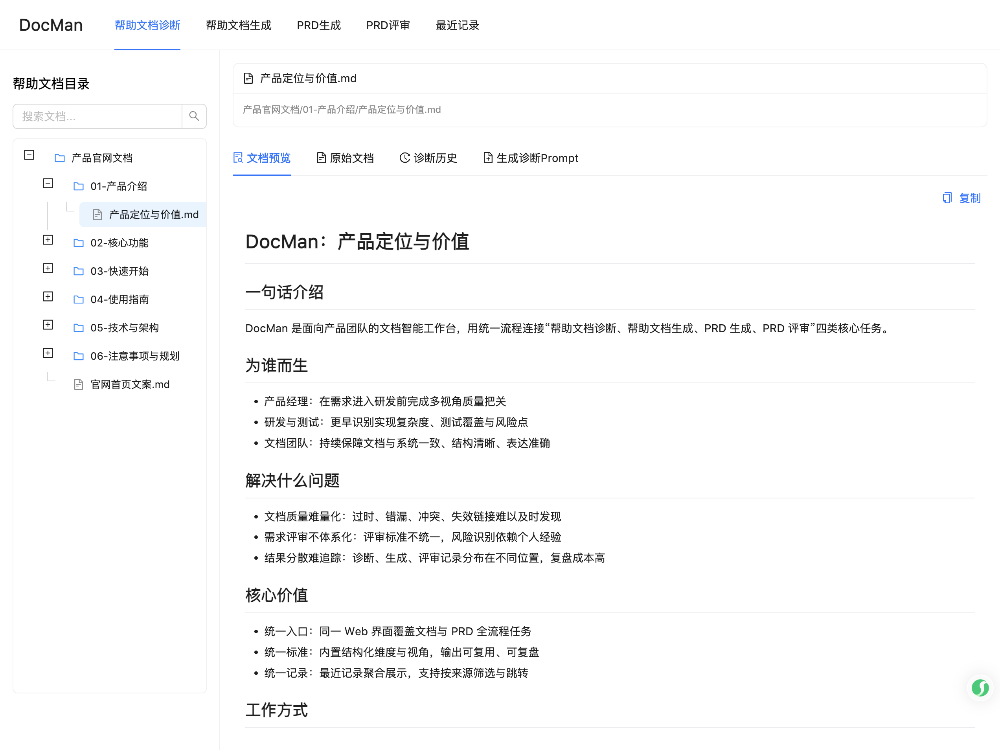
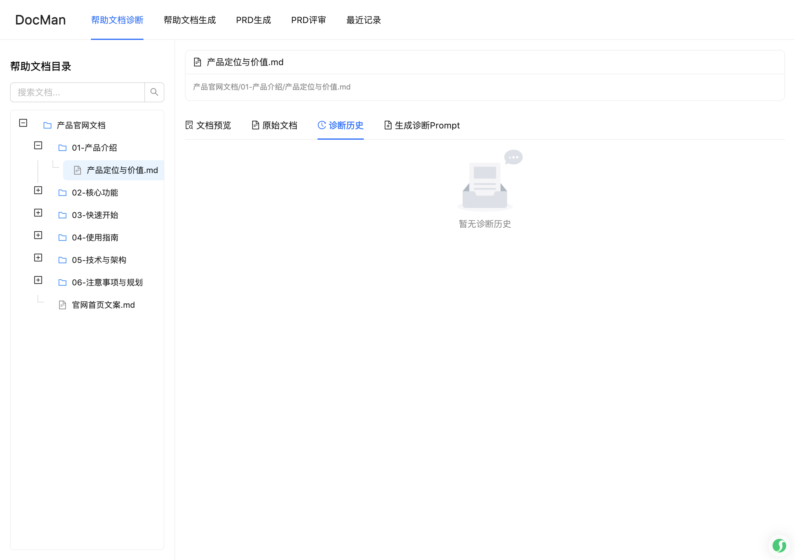
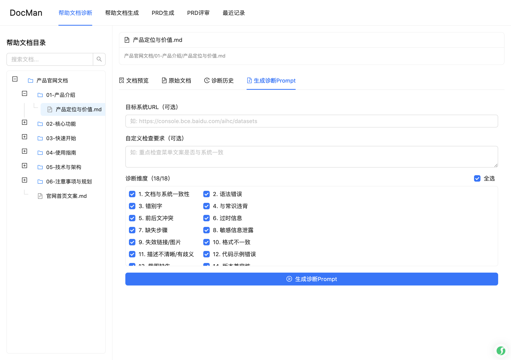
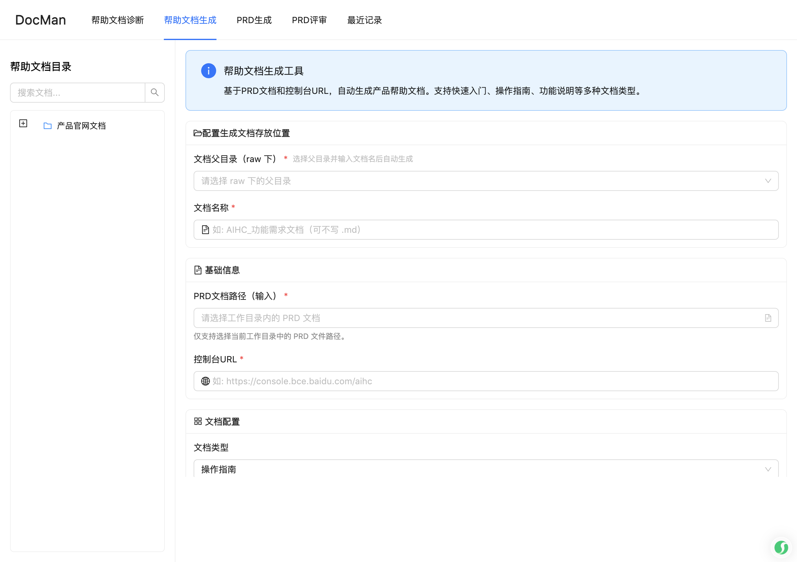
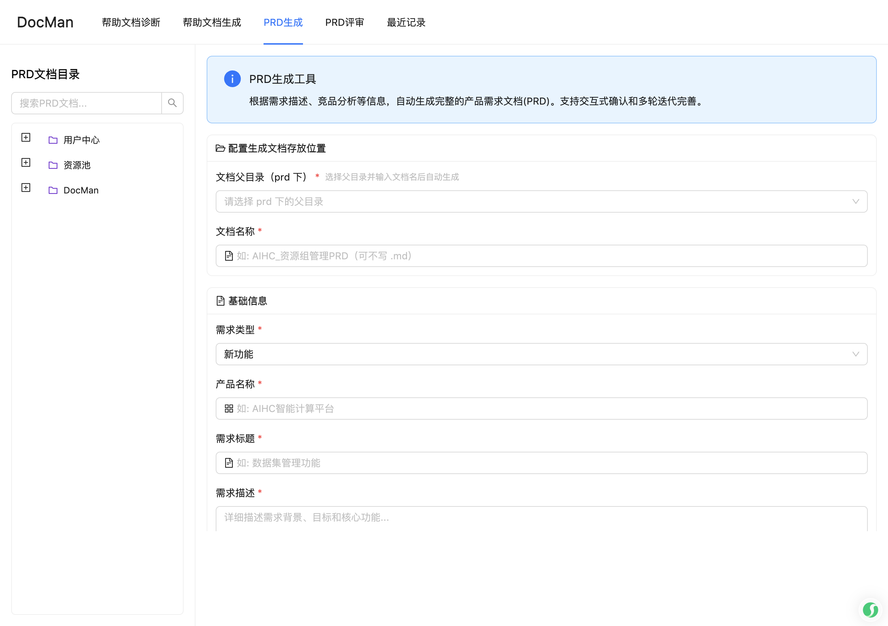
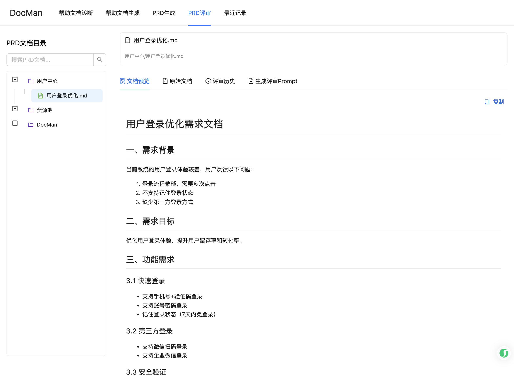
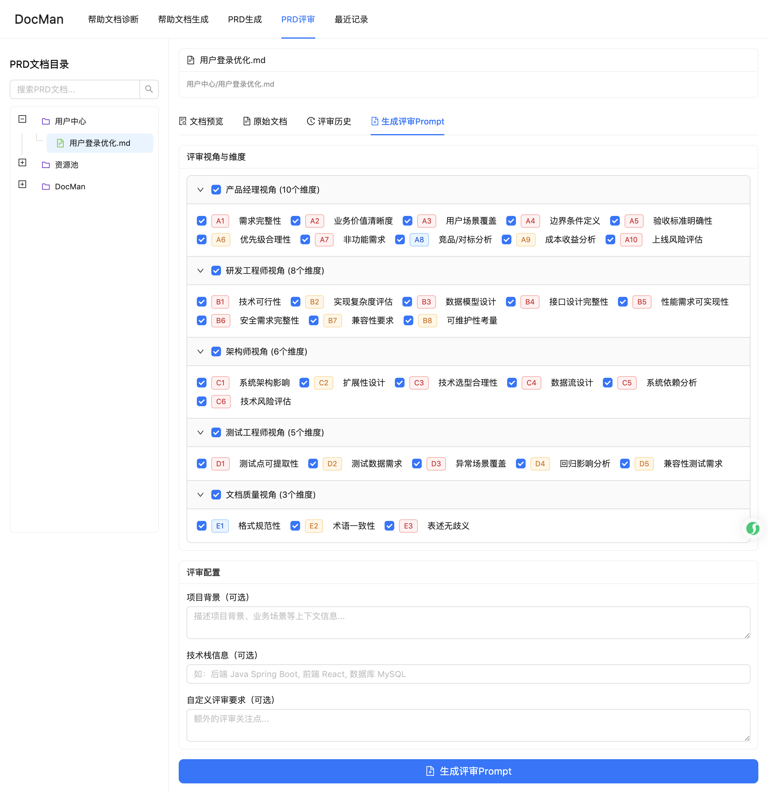
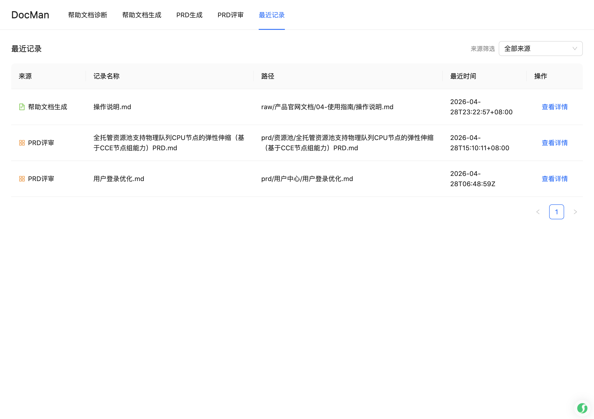

# DocMan 操作说明

## 产品概述

DocMan 是面向产品团队的文档全生命周期智能助手，提供四大核心功能：

- **帮助文档诊断**：对产品帮助文档进行全方位质量检查（18 个维度）
- **帮助文档生成**：基于 PRD 与控制台 URL，自动生成产品帮助文档
- **PRD 生成**：根据需求描述和竞品信息自动生成完整 PRD
- **PRD 评审**：从多个专业视角（产品、研发、架构、测试、文档）评审需求文档

DocMan 采用「参数配置 → Prompt 生成 → 本地 Agent 执行 Skill → 结果回看」的闭环模式。

---

## 界面说明

访问 `http://localhost:3000`，进入 DocMan Web 界面。

顶部导航栏提供五个入口：

| 菜单项 | 功能描述 | 路由 |
|--------|----------|------|
| 帮助文档诊断 | 文档质量检查（首页默认） | `/` |
| 帮助文档生成 | 基于 PRD 和控制台生成文档 | `/docgen` |
| PRD 生成 | 自动生成产品需求文档 | `/?nav=prdgen` |
| PRD 评审 | 多视角 PRD 质量评审 | `/prd-review` |
| 最近记录 | 聚合查看所有任务记录 | `/records` |

---

## 一、帮助文档诊断

用于对已有帮助文档进行质量检查，发现过时信息、错别字、与系统不一致等问题。

### 前提条件

- 待诊断文档已放置在 `raw/` 目录下
- 已准备好目标系统的访问账号（需验证与系统一致性时使用）

### 操作步骤

**步骤 1：选择待诊断文档**

在左侧**帮助文档目录**树中，点击需要诊断的文档（`.md` 文件）。

- 支持按目录层级展开/折叠
- 支持在搜索框输入关键词快速定位文档

**步骤 2：查看文档内容**

选中文档后，右侧内容区默认显示**文档预览** Tab，可预览文档渲染效果。

点击**原始文档** Tab 可查看 Markdown 源码。

**步骤 3：查看诊断历史**

点击**诊断历史** Tab，查看该文档的历史诊断记录列表，支持点击查看各次诊断的详情报告。

**步骤 4：生成诊断 Prompt**

点击**生成诊断Prompt** Tab，配置诊断参数：

- **控制台 URL**：用于验证文档与系统的一致性
- **使用已登录浏览器**：勾选后复用已有浏览器窗口，无需重复登录
- **显示浏览器操作界面**：勾选后可观察自动化操作过程

配置完成后点击**生成诊断Prompt**按钮，复制生成的 Prompt。

**步骤 5：执行诊断**

将复制的 Prompt 粘贴到本地 Agent（如 Comate、Claude Code 等）中执行。

**步骤 6：查看结果**

任务执行完成后，刷新 DocMan 页面，在**诊断历史** Tab 中查看最新诊断报告。

诊断报告输出到 `report/` 目录，修复后文档输出到 `new/` 目录。

> **注意**：诊断报告中各维度的问题数可点击，点击后自动滚动到对应章节的锚点位置，便于快速定位问题。

---

## 二、帮助文档生成

基于 PRD 文档和控制台 URL，自动生成产品帮助文档。

### 前提条件

- PRD 文档已放置在 `prd/` 目录下
- 目标产品控制台可访问

### 操作步骤

点击顶部导航**帮助文档生成**，进入生成页面。

**步骤 1：配置输出位置**

在**配置生成文档存放位置**区域：

- **文档父目录（raw 下）**：从下拉菜单选择 `raw/` 目录下的目标子目录
- **文档名称**：输入输出文档的文件名（可不写 `.md` 后缀）

选择父目录并输入文档名后，系统会自动生成完整的输出路径。

**步骤 2：配置基础信息**

- **PRD 文档路径（输入）**：从下拉菜单选择 `prd/` 目录下的 PRD 文档
- **控制台 URL**：填写产品控制台的访问地址
- **文档类型**：选择生成的文档类型
  - 快速入门
  - 操作指南（默认）
  - 功能说明
- **目标受众**：选择文档面向的读者群体
  - 普通用户（默认）
  - 开发者
  - 运维人员
- **输出格式**：选择输出文件格式，默认 `Markdown (.md)`

**步骤 3：配置浏览器（可选）**

在**浏览器配置**区域：

- **使用已登录浏览器（推荐）**：勾选后复用已有浏览器窗口，无需重复登录；请保持浏览器窗口打开状态
- **显示浏览器操作界面**：勾选后显示浏览器窗口，可观察自动化操作过程
- **截图模式**：选择「完整页面」后，Prompt 会要求优先输出整页截图，避免只截取首屏

**步骤 4：生成 Prompt 并执行**

配置完成后，点击**生成帮助文档Prompt**按钮，复制生成的 Prompt 到本地 Agent 中执行。

执行完成后，文档生成到指定的输出路径，截图保存在同级 `images/` 目录下。

---

## 三、PRD 生成

根据需求描述、竞品分析等信息，自动生成完整的产品需求文档（PRD）。

### 操作步骤

点击顶部导航 **PRD 生成**，进入 PRD 生成页面（路由 `/?nav=prdgen`）。

**步骤 1：配置输出位置**

- **文档父目录（prd 下）**：选择 PRD 输出所在的子目录
- **文档名称**：输入 PRD 文件名

**步骤 2：填写需求信息**

- **需求类型**：选择需求分类
- **需求标题**：填写需求标题
- **需求描述**：详细描述需求背景、目标和核心功能
- **初始 PRD 路径（可选）**：如已有简单 PRD 草稿，可提供路径以增量完善

**步骤 3：添加参考资料（可选）**

- **竞品链接**：输入竞品产品 URL，可添加多条
- **本地参考文档**：从 `prd/` 下选择已有 `.md` 文档作为参考，支持多选

**步骤 4：生成并执行**

点击生成 Prompt 按钮，复制到本地 Agent 执行。

---

## 四、PRD 评审

从产品经理、研发工程师、架构师、测试工程师、文档质量五个专业视角（共 32 个维度）评审 PRD。

### 前提条件

- 待评审的 PRD 文档已放置在 `prd/` 目录下

### 操作步骤

点击顶部导航 **PRD 评审**，进入评审页面。

**步骤 1：选择 PRD 文档**

在左侧 **PRD 文档目录**树中，点击选择待评审的 PRD 文档。

支持在搜索框输入关键词快速定位文档。

**步骤 2：查看评审历史**

点击右侧**评审历史** Tab，查看该 PRD 的历史评审记录。

**步骤 3：生成评审 Prompt**

点击**生成评审Prompt** Tab，配置评审参数：

- 可选择需要重点关注的评审视角（产品/研发/架构/测试/文档）
- 点击**生成评审Prompt**按钮，复制生成的 Prompt

**步骤 4：执行评审**

将 Prompt 粘贴到本地 Agent 执行，评审报告输出到 `report/prd/` 目录，过程记录到 `timeline/prd/` 目录。

**步骤 5：查看结果**

刷新页面后，在**评审历史** Tab 中查看最新评审结果。

> **注意**：评审结论仅供参考，最终决策由团队共同确定。对于复杂 PRD，建议分多次评审，每次聚焦特定视角。

---

## 五、最近记录

统一查看四类任务（帮助文档诊断、帮助文档生成、PRD 生成、PRD 评审）的历史记录。

### 操作步骤

点击顶部导航**最近记录**，进入记录聚合页面。

- **按来源筛选**：点击筛选按钮，按来源类型过滤记录（可通过来源图标快速区分）
- **查看详情**：点击记录行的**查看详情**，系统按来源跳转到对应页面并携带参数直达

---

## 六、URL 分享跳转

DocMan 支持通过 URL 直接定位到指定文档或诊断记录，便于分享和跳转。

### URL 格式说明

| 场景 | URL 格式 |
|------|----------|
| 打开指定文档 | `/?doc=操作指南/工作流/创建工作流.md` |
| 打开指定诊断记录 | `/?doc=操作指南/xxx.md&record=timeline/xxx_timeline.json` |
| 跳转到 PRD 评审 | `/prd-review?doc=路径&record=timeline路径` |

选中文档或诊断记录后，浏览器地址栏的 URL 会自动更新。复制当前 URL 即可分享给他人，对方打开链接可直达对应内容。

---

## 七、目录结构说明

| 目录 | 用途 |
|------|------|
| `raw/` | 放置待诊断的原始帮助文档 |
| `prd/` | 放置 PRD 文档（评审/生成的输入） |
| `new/` | 诊断后修复的文档（自动生成） |
| `report/` | 诊断/评审报告（自动生成） |
| `timeline/` | 任务过程记录（自动生成） |
| `screenshots/` | 诊断过程截图（自动生成） |

> **重要**：原始文档必须放在 `raw/` 目录下，PRD 文档必须放在 `prd/` 目录下，否则系统无法正确发现文件和生成记录。

---

## 八、常见问题

**Q：执行 Prompt 时提示需要登录怎么办？**  
A：在参数配置时勾选**使用已登录浏览器（推荐）**选项，可复用已有浏览器的登录状态，避免重复登录。

**Q：诊断/评审结果在哪里查看？**  
A：刷新 DocMan 页面后，在对应文档的**诊断历史**（或**评审历史**）Tab 中查看，也可在**最近记录**页面统一查看所有任务结果。

**Q：如何快速定位诊断报告中的具体问题？**  
A：在诊断历史中点击各维度的问题数，页面会自动滚动到诊断报告对应章节的锚点位置。

**Q：PRD 评审视角太多，如何有重点地评审？**  
A：在生成评审 Prompt 时，可选择需要重点关注的视角。建议对复杂 PRD 分多次评审，每次聚焦 1-2 个视角。
